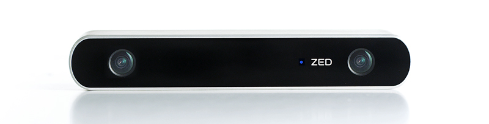

# Zed Camera Grabber
Zed Camera Grabber (ZCG) is an open source tool for recording images from the zed
camera.

## Requirements

ZCG requires the following packages to build:

* OpenCV (3.1 or 2.4 for the Jetson TX1)
* Zed SDK
* Boost

## How to build

ZCG works under Linux environments. We recommend a so-called out of source build 
which can be achieved by the following command sequence:

* mkdir build
* cd build
* cmake ../
* make -j\<number-of-cores+1\>

## How to use
* For recording: ./grabber -grab /path/to/the/directory/
* For reading: ./grabber -read /path/to/the/directory/
* Optionally you can add:
 - res HD720 (HD1080, HD2K, VGA) to specify the resolution. The default value is HD720;
 - conf: 100 to specify the confidence of the depth. The default value is 70;
 - exp: 100 to specify the exposure. The default value is 40.